# Premium Kart (MERN Application)

An E-commerce web Application which offers a seamless and secure shopping experience.

## Live Demo

<table>
  <tr>
    <th>Authentication</th>
  </tr>
  <tr>
    <td>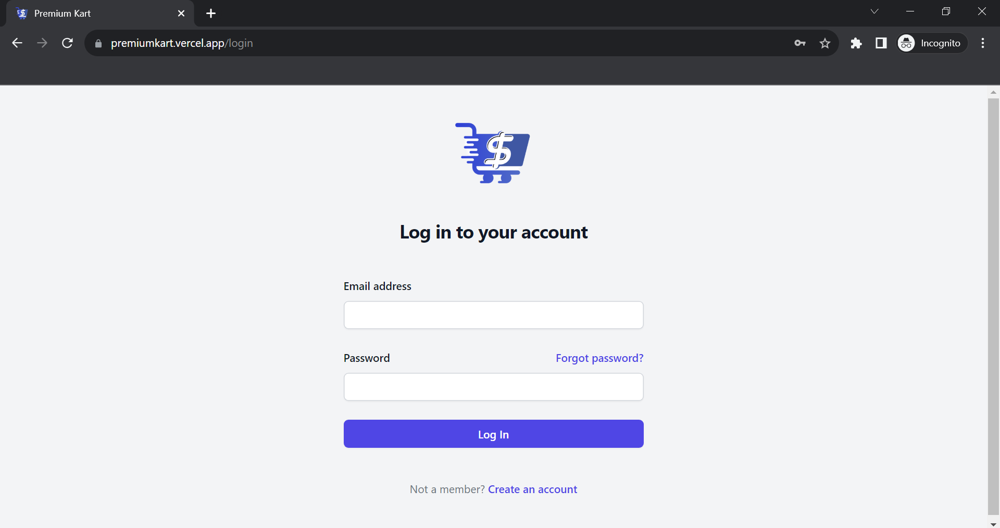</td>
    <td>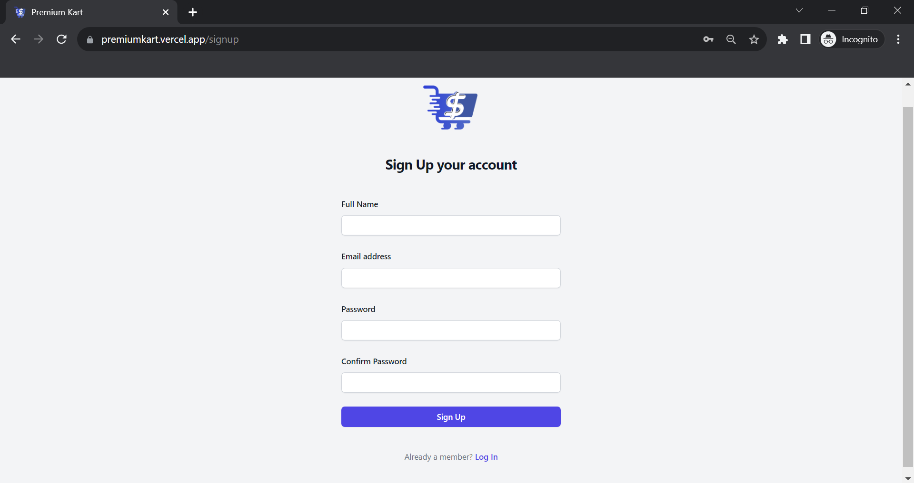</td>
  </tr>
  <tr>
    <td>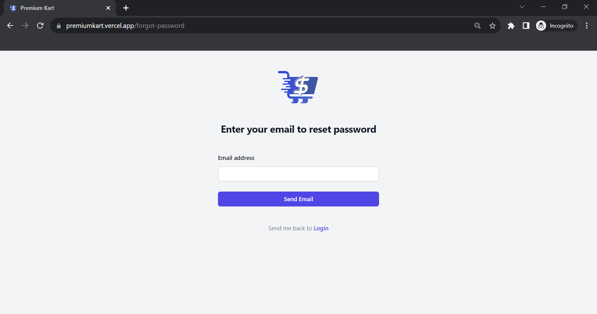</td>
  </tr>
  <tr>
    <th>Home</th>
  </tr>
  <tr>
    <td>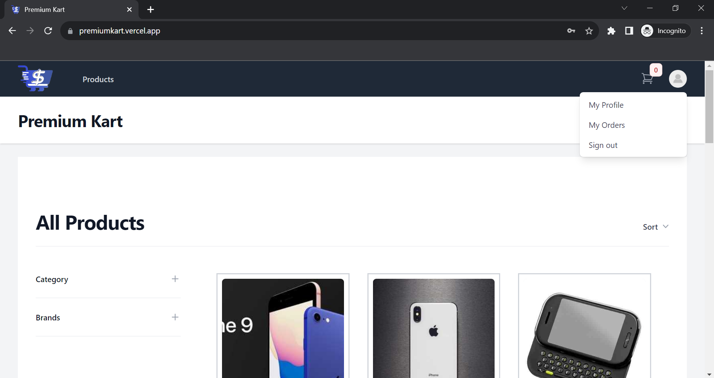</td>
    <td>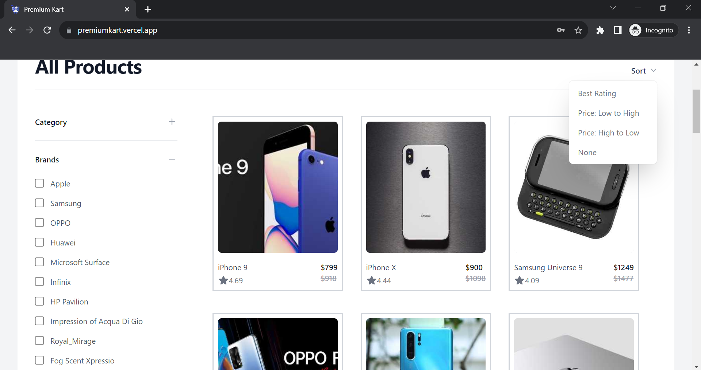</td>
  </tr>
  <tr>
    <th>Profile page</th>
    <th>Orders Info page</th>
  </tr>
  <tr>
    <td>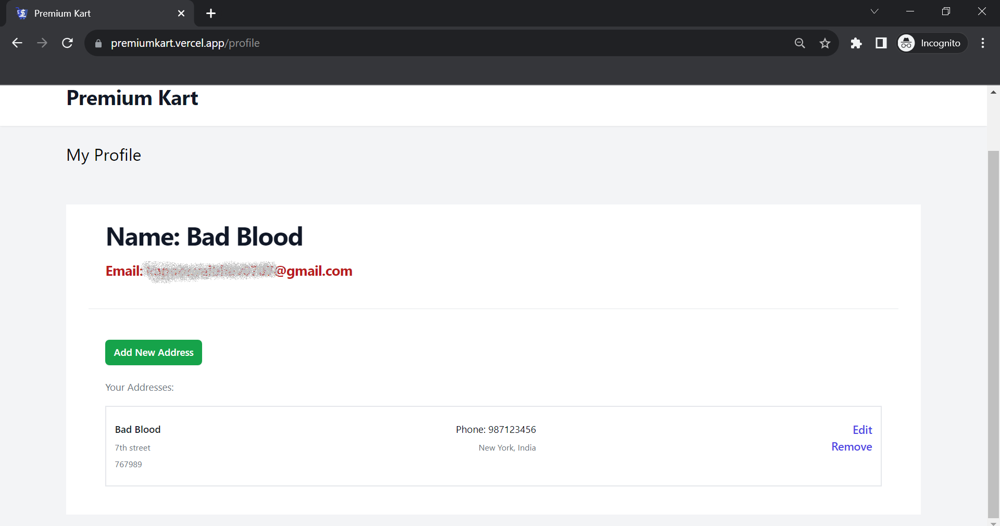</td>
    <td>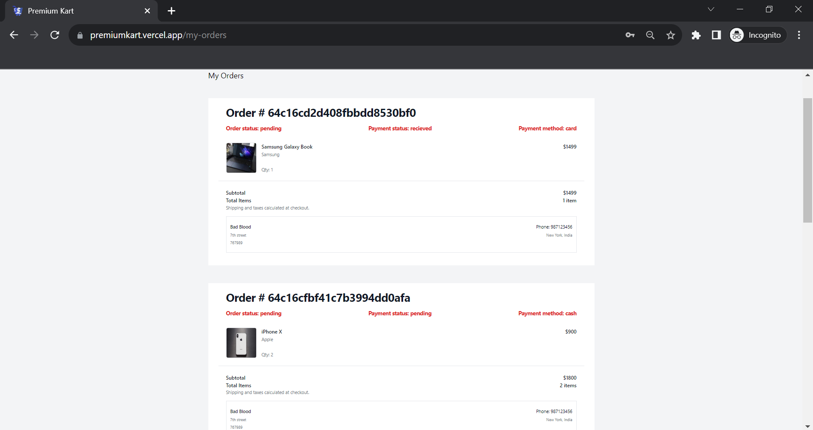</td>
  </tr>
  <tr>
    <th>Product Detail page</th>
    <th>Cart page</th>
  </tr>
  <tr>
    <td>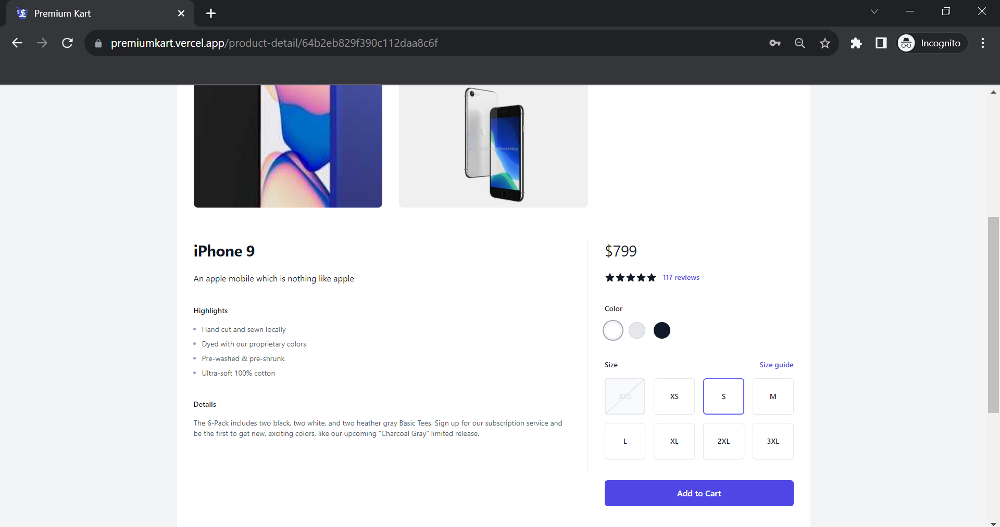</td>
    <td>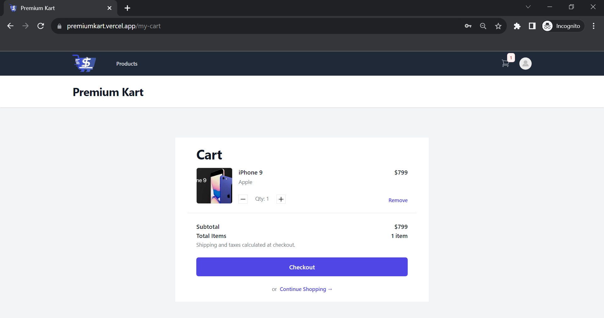</td>
  </tr>
  <tr>
    <th>Checkout Page</th>
  </tr>
  <tr>
    <td>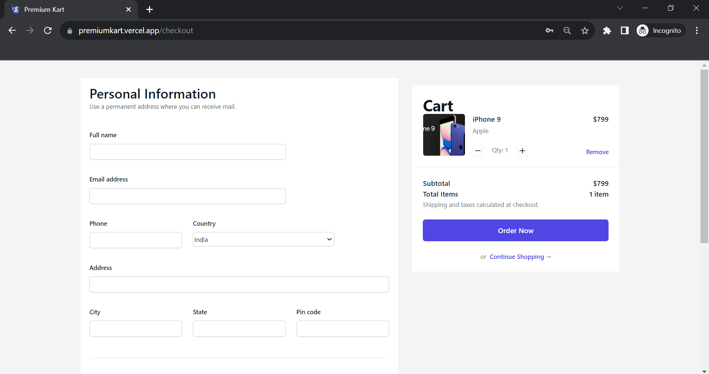</td>
    <td>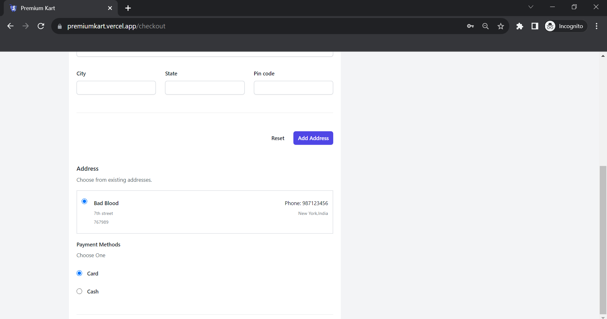</td>
  </tr>
  <tr>
    <th>Payment Gateway</th>
    <th>Order Success Page</th>
  </tr>
  <tr>
    <td>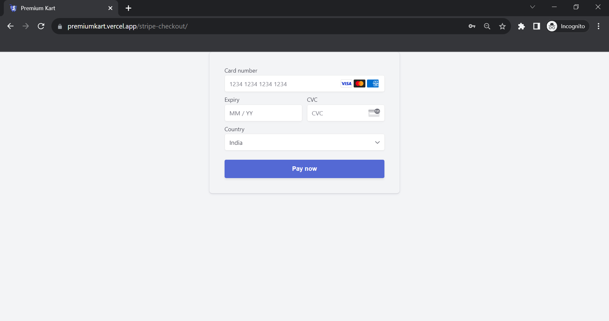</td>
    <td>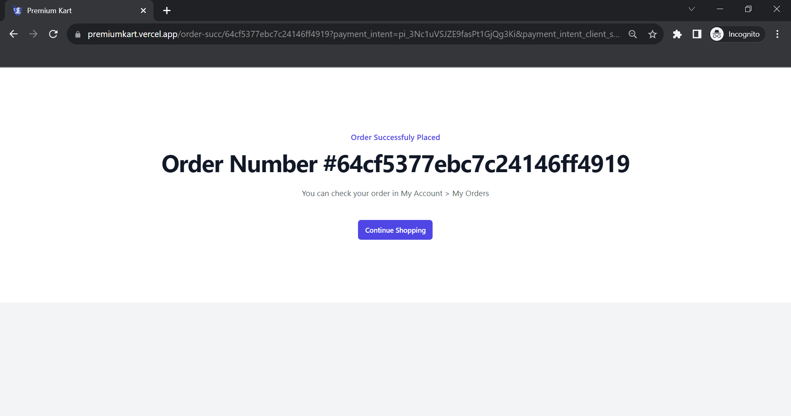</td>
  </tr>
  <tr>
    <th>Email recieved after order success</th>
  </tr>
  <tr>
    <td>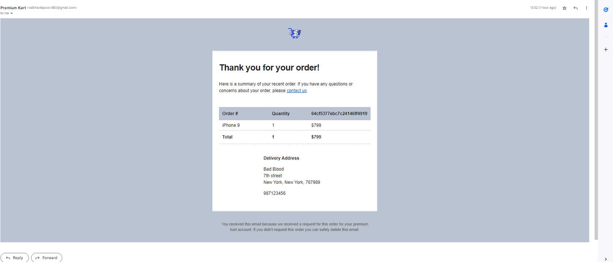</td>
  </tr>
  <tr>
    <th>Admin Panel</th>
  </tr>
  <tr>
    <td>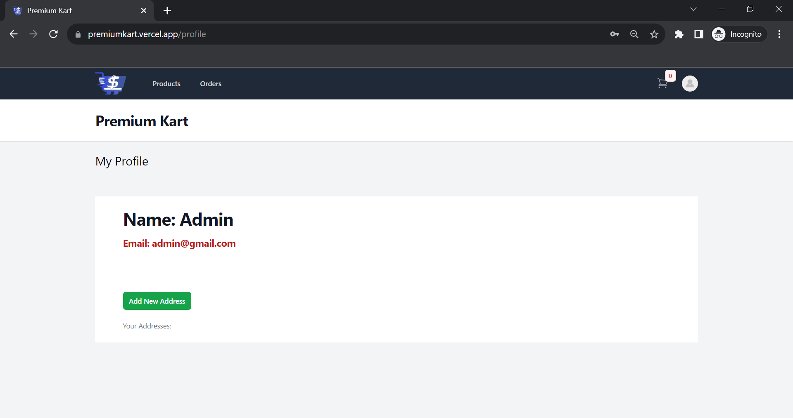</td>
    <td>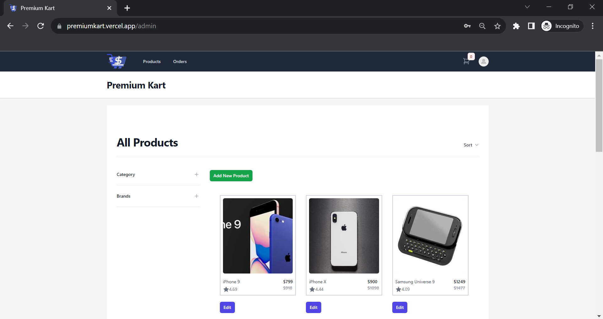</td>
  </tr>
  <tr>
    <td>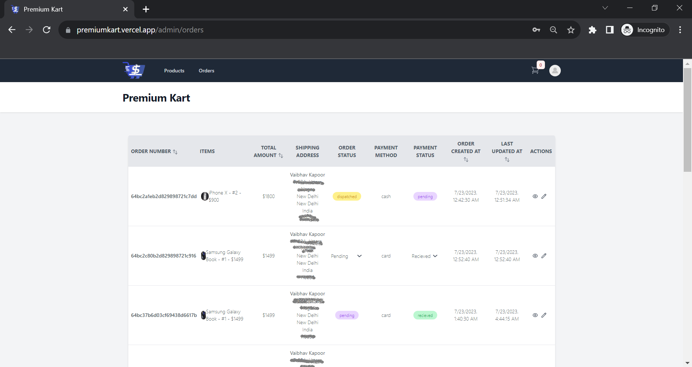</td>
  </tr>
  
 </table>

Live Website: [Premium Kart](https://premiumkart.vercel.app/)

## Used Libraries
- `react-js`
- `redux`
- `tailwind css`
- `node-js`
- `express-js`
- `mongoDB`
- `mongoose`
- `passport js/jwt`
- `nodemailer`
- `stripe-payments`

## Features

- User authentication and registration: Customers can create accounts, securely log in, and manage their profiles.

- Product catalog: A comprehensive catalog showcasing your products, with filtering options for easy navigation.
- Shopping cart: Users can add items to their cart, manage quantities, and proceed to checkout seamlessly.
- Payment integration: Secure payment gateways to ensure safe and convenient transactions.
- Order tracking: Customers can track their orders and receive updates on the shipping status.
- Admin panel: An intuitive dashboard for store owners to manage products, orders, and customer data.

